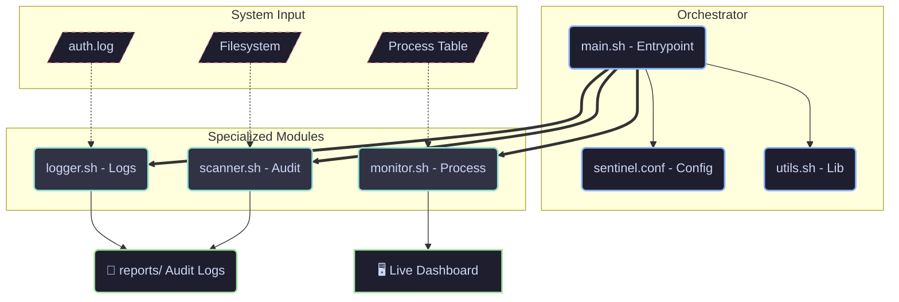

# 🛡️ Sentinel-Core: Advanced Linux Security Orchestrator

  
  
  
  

**Sentinel-Core** is a modular, high-performance security auditing and threat-hunting tool developed for Linux environments. Built with an **SRE mindset**, it bridges the gap between manual system hardening and automated security monitoring.

---

## 🚀 Key Features

* **🧱 Modular Architecture:** Fully decoupled modules for high maintainability.
* **🎯 Threat Hunting:** Focus on **Fileless Malware detection** via `/proc/$PID/exe`.
* **📊 SRE Ready:** Native **JSON export** for ELK Stack or Splunk integration.
* **🔍 Intelligent Logging:** RegEx-powered engine to detect brute-force and injections.
* **🛡️ Zero-Trust Audit:** Deep-scan of SUID/SGID and critical FHS permissions.

---

## ⚙️ Component Architecture

Este diagrama representa la orquestación de datos y la comunicación entre módulos.

💻 Installation & Usage
⚙️ Prerequisites

    OS: Arch Linux / AlmaLinux 9 / Debian 12.

    Privileges: Root access (sudo) is required.

    Dependencies: jq (for JSON output).

🚀 Quick Start

    Clone & Access:
    Bash

    git clone (https://github.com/gleiva-it/Sentinel-Core-Linux-Security-Orchestrator.git)
    cd Sentinel-Core-Linux-Security-Orchestrator

    Permissions:
    Bash

    chmod +x main.sh lib/globals.sh modules/*.sh

    Execution:
    Bash

    # Standard Mode
    sudo ./main.sh

    # Pipeline Mode (JSON)
    sudo ./main.sh --json

🛡️ Why Sentinel-Core?

    Portability: Zero hardcoded paths; everything is in sentinel.conf.

    Observability: Converts system noise into structured, actionable data.

    Active Response: Includes surgical tools to manage process signals (SIGSTOP, SIGKILL) during live monitoring.

👤 Author

Gonzalo Leiva

    🎓 Computer Science Student @ Universidad de Montevideo (UM).

    🛡️ Focus: Cybersecurity (Blue Team) & SRE.

    🛠️ Tech: Bash, Go, Python, Linux Hardening.

📄 License

Licensed under the MIT License.
